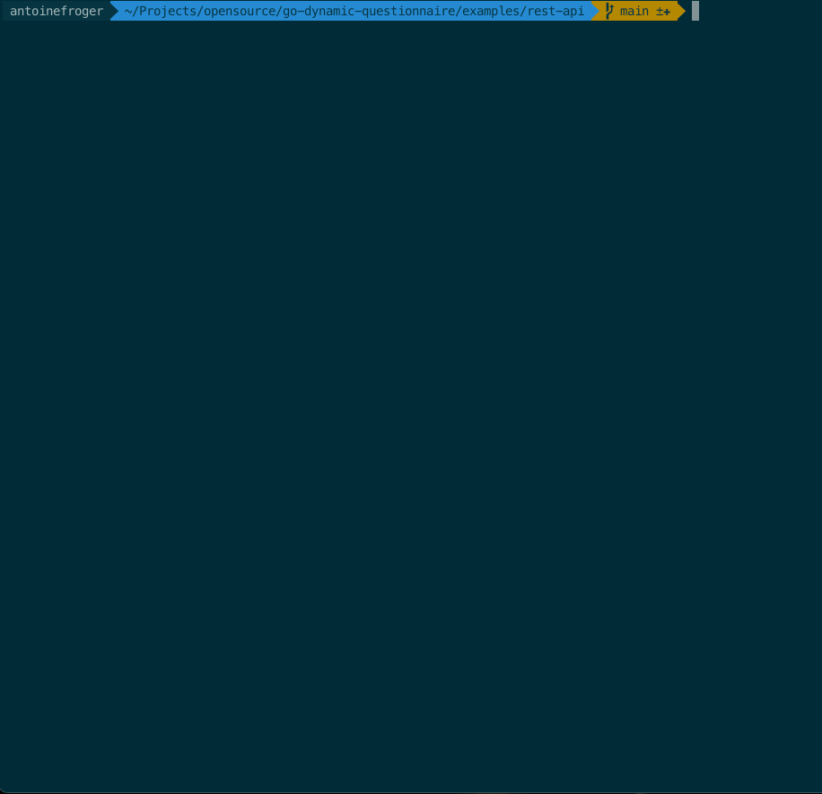

# Dynamic Questionnaire Examples

This directory contains various examples of how to use the **Go Dynamic Questionnaire** library in different applications and scenarios.
The library provides a flexible way to create interactive questionnaires with conditional logic based on previous answers.

## Examples

### 1. CLI Application (`cli/`)

**Use Case**: Interactive command-line questionnaire tool

**Run Example**:

```bash
cd cli/
go run main.go tech.yaml
# or
go run main.go yes-no.yaml
```


### 2. REST API Server (Planned)

**Use Case**: Web service providing questionnaire API endpoints

**Endpoints**

```
GET  /questionnaires      - List available questionnaires
POST /questionnaires/{id} - Get questions (with optional answers)
```



[More details about it here](./rest-api/README.md)
