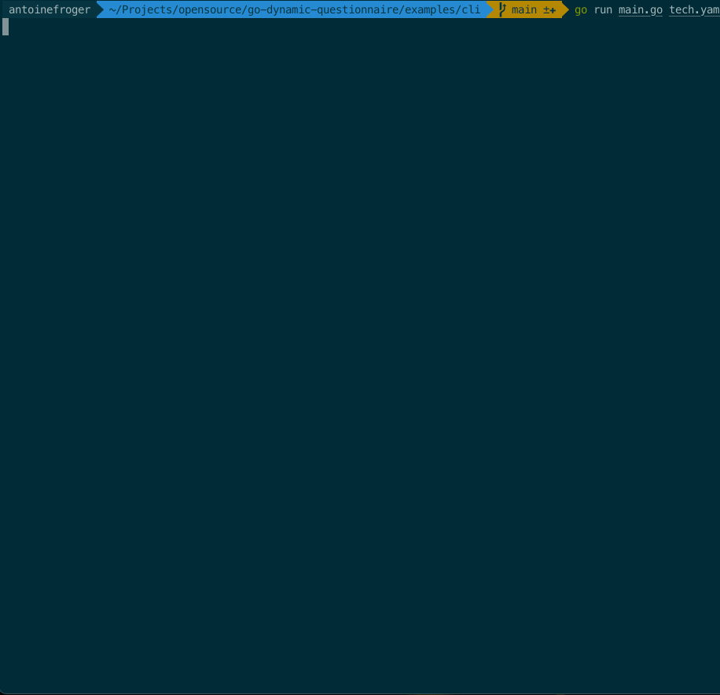

# Dynamic Questionnaire Examples

This directory contains various examples of how to use the **Go Dynamic Questionnaire** library in different applications and scenarios.
The library provides a flexible way to create interactive questionnaires with conditional logic, progress tracking, and closing remarks based on previous answers.

## Examples

### 1. CLI Application (`cli/`)

**Use Case**: Interactive command-line questionnaire tool with progress display

**Features**

- Real-time progress tracking (`📊 Progress: 2/3 questions answered`)
- Visual completion indicators (`🎉 QUESTIONNAIRE COMPLETE!`)
- Personalized closing remarks based on answers
- Robust input validation and error handling

**Run Example**

```bash
cd cli/
go run main.go tech.yaml
# or
go run main.go yes-no.yaml
```

**Demo**



### 2. REST API Server (`rest-api/`)

**Use Case**: Web service providing questionnaire API endpoints with full REST support

**Features**

- Complete REST API with progress tracking
- JSON responses with questions, progress, and closing remarks
- CORS support for web applications
- Comprehensive error handling
- Multiple questionnaire support

**Endpoints**

```
GET  /questionnaires      - List available questionnaires
POST /questionnaires/{id} - Get questions with progress and completion
```

**Run Example**

```bash
cd rest-api/
go run main.go
```

**Enhanced API Responses**:

*Starting questionnaire*:

```json
{
  "questions": [...],
  "completed": false,
  "progress": {
    "current": 0,
    "total": 3
  },
  "message": "Questionnaire started"
}
```

*Mid-progress*:

```json
{
  "questions": [...],
  "completed": false,
  "progress": {
    "current": 2,
    "total": 5
  },
  "message": "Next questions retrieved"
}
```

*Completion with closing remarks*:

```json
{
  "questions": [],
  "closing_remarks": [
    {
      "id": "thank_you",
      "text": "Thank you for your feedback!"
    },
    {
      "id": "follow_up", 
      "text": "Based on your responses, here's what we recommend..."
    }
  ],
  "completed": true,
  "message": "Questionnaire completed - here are your personalized remarks!"
}
```


[More details about the REST API here](./rest-api/README.md)

## Getting Started

1. **Choose an example** based on your use case
2. **Run the example** to see the library in action
3. **Examine the code** to understand the implementation
4. **Customize** the questionnaire YAML files for your needs
5. **Integrate** the patterns into your own application
